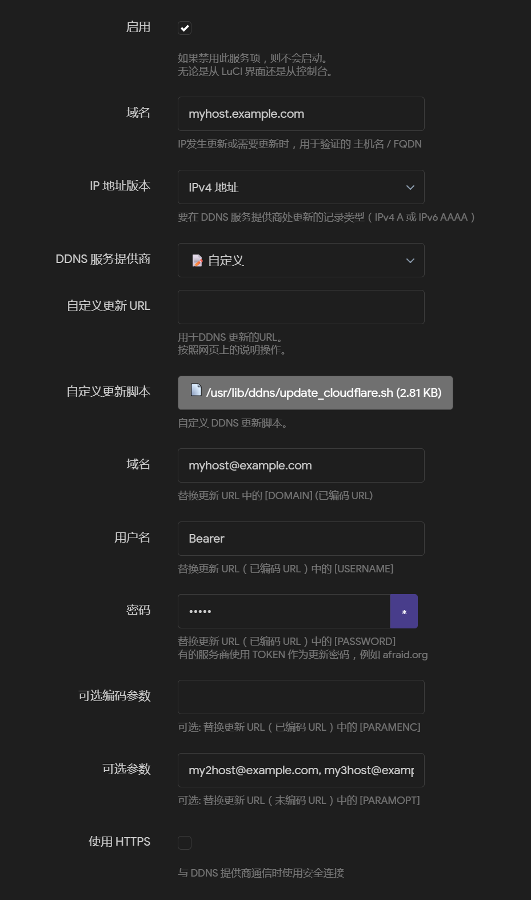

## update_cloudflare.sh

自用 Cloudflare DNS 更新脚本，用于 `luci-app-ddns` + `ddns-scripts`。

支持IPV4与IPV6，支持Cloudflare API v4，支持Token/Email+Key两种认证方式。

Built with Gemini 3 Flash.

### 使用方法

将脚本上传到`usr/lib/ddns`目录下，并赋予执行权限。然后在`luci-app-ddns`中添加一个新的DDNS服务，选择`自定义脚本`，并填写以下信息：

- **服务名称**：自定义，随意填写。
- **域名（用于验证）**：脚本会根据这个域名查找对应的DNS记录，来判断是否需要更新。
- **自定义更新脚本**：选择`/usr/lib/ddns/update_cloudflare.sh`。
- **域名**：需要更新的域名，格式为`name@domain.com`。
- **用户名**：如果使用Token认证，填写`Bearer`；如果使用Email+Key认证，填写Cloudflare账号的Email地址。
- **密码**：如果使用Token认证，填写Cloudflare API Token；如果使用Email+Key认证，填写Cloudflare API Key。
- **可选参数**：使用逗号分隔的其他域名列表，如`my2host@example.com, my3host@example.com`。脚本会同时更新这些域名的DNS记录，格式同上。

### License

MIT
